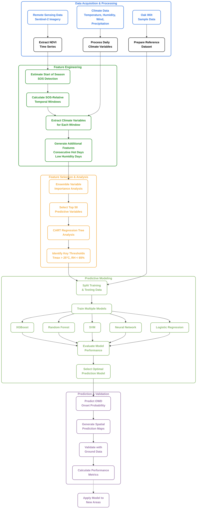

# Oak Wilt Disease Prediction: A Data-Driven Approach

## Overview
This research develops a predictive framework for early detection of Oak Wilt Disease (OWD) using remote sensing and climate data. By integrating Sentinel-2 imagery with daily climate variables, we identify key environmental conditions that trigger disease onset, allowing for proactive management interventions before visible symptoms appear.

## Workflow Diagram

## Methodology Details

### 1. Data Acquisition & Processing
- **Remote Sensing**: Sentinel-2 multispectral imagery (10-20m resolution) collected throughout the growing season
- **Climate Data**: Daily measurements of temperature (Tmax, Tmin), relative humidity, precipitation, wind speed and direction
- **Reference Data**: Field observations of OWD presence/absence across 320 plots, with onset dates recorded for positive cases

### 2. Feature Engineering
- **Start of Season (SOS) Detection**: Novel approach using local minima in NDVI time series to identify leaf emergence timing
- **Temporal Windows**: Define 10 temporal windows (5 before SOS, 5 after SOS) to capture relevant climate conditions
- **Climate Feature Extraction**: Aggregate climate variables over each temporal window (mean, max, min, standard deviation)
- **Specialized Features**: Create specific indicators for consecutive hot days, low humidity periods, and combined hot-dry conditions

### 3. Variable Selection & Threshold Identification
- **Ensemble Feature Importance**: Combine variable rankings from multiple models (XGBoost, Random Forest, Logistic Regression)
- **Dimensionality Reduction**: Select top 50 variables with highest predictive power
- **CART Analysis**: Identify critical thresholds and decision rules through decision tree modeling
- **Key Findings**: Maximum temperature >25°C for ≥3 consecutive days + relative humidity <65% within 10 days after SOS

### 4. Predictive Modeling
- **Model Evaluation**: Compare five machine learning approaches (XGBoost, Random Forest, SVM, Neural Network, Logistic Regression)
- **Dual Prediction Tasks**: 
  1. Classification: Will OWD occur? (yes/no)
  2. Regression: When will OWD onset occur? (day of year)
- **Performance Metrics**: Accuracy, F1-score, RMSE, and success ratio within ±8 days window
- **Best Model**: XGBoost (67.2% success rate, RMSE of 7 days for onset prediction)

### 5. Spatial Prediction & Validation
- **Prediction Maps**: Generate probability surfaces showing likelihood of OWD onset
- **Uncertainty Assessment**: Identify areas with less reliable predictions
- **Validation**: Compare predictions with field observations
- **Application**: Inform targeted management interventions in high-risk areas

## Key Findings

1. **Critical Climate Triggers**: The combination of high temperature (>25°C) and low humidity (<65%) for at least three consecutive days following leaf emergence creates optimal conditions for OWD onset.

2. **Temporal Sensitivity**: The 10-day window immediately after the Start of Season represents the most critical period for disease prediction.

3. **Model Performance**: The XGBoost algorithm demonstrated superior performance in predicting both OWD occurrence (83.1% accuracy) and onset timing (RMSE of 7 days).

4. **Early Warning Potential**: This approach enables prediction of OWD risk 10-30 days before visible symptoms appear, significantly expanding the window for preventive interventions.

## Significance

This research advances forest health monitoring by:
1. Developing a reproducible methodology for early disease detection
2. Identifying specific climate thresholds that trigger OWD onset
3. Creating a framework applicable across broad spatial scales
4. Enabling proactive rather than reactive management strategies

The integration of remote sensing with climate data offers a powerful approach for monitoring forest health in the face of emerging threats and changing climate conditions.
